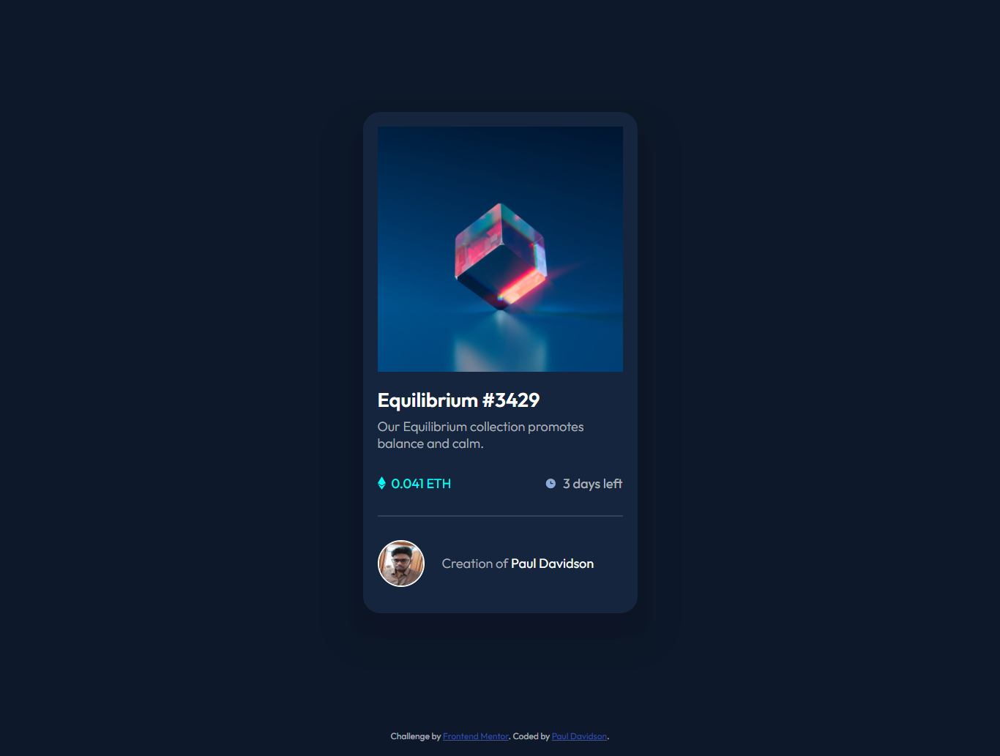
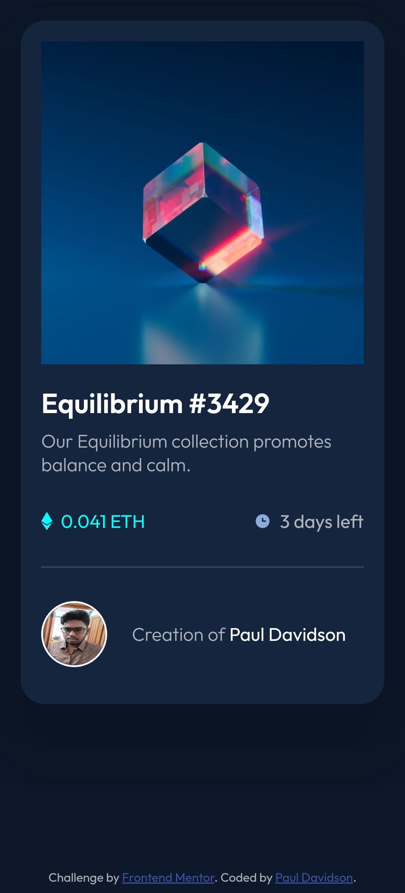

# Frontend Mentor - NFT preview card component solution

This is a solution to the [NFT preview card component challenge on Frontend Mentor](https://www.frontendmentor.io/challenges/nft-preview-card-component-SbdUL_w0U). Frontend Mentor challenges help you improve your coding skills by building realistic projects. 

## Table of contents

- [Overview](#overview)
  - [The challenge](#the-challenge)
  - [Screenshot](#screenshot)
  - [Links](#links)
- [My process](#my-process)
  - [Built with](#built-with)
  - [What I learned](#what-i-learned)
  - [Continued development](#continued-development)
- [Author](#author)
- [Acknowledgments](#acknowledgments)


## Overview

### The challenge

Users should be able to:

- View the optimal layout depending on their device's screen size
- See hover states for interactive elements

### Screenshot

Dekstop



Mobile



### Links

- Solution URL: [https://www.frontendmentor.io/solutions/mobile-first-nft-preview-card-component-IjNI_hXg-](https://www.frontendmentor.io/solutions/mobile-first-nft-preview-card-component-IjNI_hXg-)
- Live Site URL: [(https://davidson-nft-preview.netlify.app/](https://davidson-nft-preview.netlify.app/)


## My process

### Built with

- Semantic HTML5 markup
- CSS custom properties
- Flexbox
- CSS Grid
- Mobile-first workflow

### What I learned

shadow used in the card component

```css
.container {
  box-shadow: 13px 30px 5px 5px hsla(219, 54%, 9%, 0.5),
    -13px 30px 5px 5px hsla(219, 54%, 9%, 0.5),
    13px 30px 5px 50px hsla(219, 54%, 9%, 0.2),
    -13px 30px 5px 50px hsla(219, 54%, 9%, 0.2);
}
```

### Continued development

- highlighting the image needs improvement
- mobile view needs some tweaking
- dekstop view need some review
- some warnings to recyle


## Author

- Github - [@Conscious-Mind](https://github.com/Conscious-Mind)
- Frontend Mentor - [@Conscious-Mind](https://www.frontendmentor.io/profile/Conscious-Mind)
- Linkedin - [@PaulDavidson](https://www.linkedin.com/in/paul-david-son/)


## Acknowledgments

Thanks to the Frontend Mentor for giving me this challenge.

